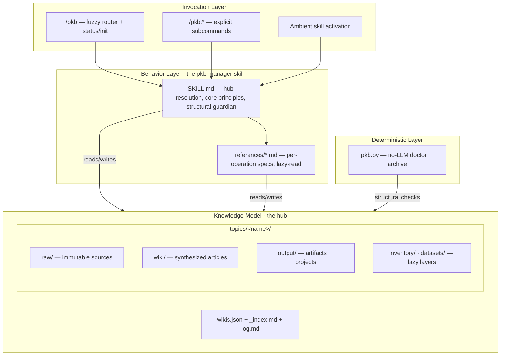

# LLM Wiki — Agent & Plugin Architecture

## 1. Purpose and Scope

`llm-wiki` is a Claude Code plugin that turns the agent into the **compiler and query engine** for a personal, LLM-maintained knowledge base. It ships no server and no compiled logic: its "program" is a body of behavioral instructions (a skill, a set of command specs, and reference docs) plus one deterministic Python CLI for the structural checks that do not need an LLM.

This document is the **design blueprint** for the plugin itself — the rationale behind its components, how they compose, and how work flows through them. It is the reference to consult before designing a new feature or reshaping an existing one. It is *not* the operational spec: the authoritative, executable detail of each operation lives in the skill references (`plugin/skills/pkb-manager/references/*.md`), and the runtime wiki data lives in the user's hub, never in this repo.

Two design goals shape everything below:

1. **The agent is the runtime.** There is no service to deploy. Behavior is prose that Claude reads and executes, so the architecture optimizes for what an LLM can follow reliably and cheaply, not for what a CPU can run.
2. **Content work and plugin work stay separate.** Using the wiki (research, ingest, compile, query) and developing the plugin (editing prompts, tests, release) are different roles with different instruction sources, so neither pays for the other's context. See [`CLAUDE.md`](../CLAUDE.md) § "Two Roles".

## 2. Architectural Principles

- **Behavioral instructions as code.** The markdown *is* the implementation. Editing a reference changes runtime behavior directly — there is no build step and no generated artifact between the prose and the agent.
- **One source of truth, lazy-loaded.** All behavior originates in `plugin/`. The skill body and its references load only when wiki work activates, so the full protocol costs almost nothing until it is needed.
- **Raw is immutable; the wiki is synthesized; indexes are derived.** Sources are recorded once and never edited. Articles are written *from* sources, not copied. `_index.md` files are a cache rebuilt from frontmatter — never the source of truth.
- **Deterministic checks complement agentic ones.** Anything that can be verified without judgment (file placement, frontmatter schema, index drift, archive registry) is also implemented in `pkb.py`, so it can run in CI and in the test suite at zero LLM cost.
- **Topic isolation.** One topic, one wiki, one isolated index space. Queries stay focused; unrelated topics never pollute each other's search.
- **Tool-agnostic linking.** Every cross-reference carries both an Obsidian `[[wikilink]]` and a standard markdown link, so the wiki is readable by Obsidian, the agent, GitHub, and a plain text editor alike.
- **Trust is a first-class field.** Articles carry `confidence`, `volatility`, and `verified` metadata; freshness is a computed score, not a guess.
- **Migrations are the checkup path, human-gated.** Schema changes are expressed as updated checkup rules; `/pkb:doctor --fix` migrates mechanically, and anything lossy stays behind an explicit, dry-run-first gate.

## 3. System Architecture

The plugin is four thin layers over a knowledge model. Higher layers translate intent into operations; lower layers hold state.

- **Invocation Layer.** `/pkb <natural language>` runs the fuzzy router, which classifies intent and dispatches to the right subcommand; `/pkb:*` invokes a subcommand directly; the skill can also activate ambiently when the user works in a wiki directory.
- **Behavior Layer.** `SKILL.md` is the always-relevant manifest (hub resolution, core principles, the structural guardian). Each `references/*.md` is the deep spec for one operation, pulled into context only when that operation runs. The fuzzy router itself lives in the `/pkb` command spec (see §4.2).
- **Deterministic Layer.** `pkb.py` reimplements the structural subset of doctor and archive in dependency-free Python, so those checks are reproducible and cheap. The agentic `/pkb:doctor` remains the full editorial protocol.
- **Knowledge Model.** The hub is a lightweight registry; all content lives in isolated topic wikis. This layer is described in §5.

## 4. Components

### 4.1 The pkb-manager skill

The behavioral core. `SKILL.md` carries the hub-resolution protocol, the ten core principles, and the "structural guardian" that runs lightweight integrity checks after writes (the NL-to-subcommand fuzzy router lives in the bare `/pkb` command spec — §4.2). It delegates each workflow to a reference doc (`ingestion.md`, `compilation.md`, `doctor.md`, `audit.md`, …). The split matters: the manifest is small and frequently relevant, while the references are large and individually rare, so lazy-loading keeps the working context lean.

### 4.2 Command specs

Each `/pkb` and `/pkb:*` command is a markdown spec in `plugin/commands/`. A command spec parses its arguments, resolves the target wiki, and drives the relevant skill workflow. The bare `/pkb` command additionally hosts the **fuzzy router** — the NL-to-subcommand mapping that lets a user say what they want without learning the command surface.

### 4.3 The deterministic CLI

`pkb.py` is a standalone implementation of the no-LLM parts of doctor and archive. It is the same engine the test suite exercises (`tests/test-local-cli-doctor.sh`), which is how structural guarantees stay regression-tested without paying for model calls.

### 4.4 The knowledge model

The data the agent compiles against — a hub registry plus isolated topic wikis with immutable `raw/`, synthesized `wiki/`, generated `output/`, and lazy `inventory/`/`datasets/` layers. Detailed in §5; the authoritative file formats live in `references/wiki-structure.md`.

## 5. Knowledge Model

The model is deliberately filesystem-native: plain markdown with YAML frontmatter, navigable by any tool.

- **Hub** (`~/llm-wiki-data/` or a configured path) — a registry only: `wikis.json` (the topic index), `_index.md` (human view), `log.md` (global activity). No content lives at the hub.
- **Topic wiki** (`topics/<name>/`) — a full, isolated knowledge base:
  - `raw/` — immutable source material (`articles/`, `papers/`, `repos/`, `notes/`, `data/`). Once ingested, never edited.
  - `wiki/` — synthesized articles (`concepts/`, `topics/`, `references/`, `theses/`), cross-linked and confidence-scored.
  - `output/` — generated artifacts and `projects/` (each with a `WHY.md`).
  - `inventory/`, `datasets/` — lazy layers for durable tracking records and large/external data manifests, created only when used.
- **Derived indexes.** Every managed directory has an `_index.md` that is a *cache* rebuilt from the files' frontmatter. The agent reads indexes first for navigation but stale-checks them (file count vs row count) before trusting them. This makes concurrent writes safe: any reader can rebuild the truth from disk.
- **Trust metadata.** Articles carry `confidence` (high/medium/low), `volatility` (hot/warm/cold), and `verified` dates; a composite **freshness score** decays per volatility tier so the right articles surface for review at the right time.
- **Archive lifecycle.** Whole topics move to `topics/.archive/<slug>` with `status: archived` in the registry — preserved but hidden from default query/compile/research/maintenance, restorable on demand.

## 6. Core Flows

- **The main loop — research → ingest → compile → query.** Research dispatches parallel agents that search and ingest sources; compilation synthesizes `raw/` into cross-linked `wiki/` articles; query answers from the wiki with citations and honest gaps. Each step updates indexes and appends to `log.md`.
- **Fuzzy routing.** `/pkb <text>` classifies the input (URL → ingest, question → query, topic → research, …) and dispatches, so the natural-language surface and the explicit `/pkb:*` surface share one behavior set.
- **Checkup as migration.** When the schema evolves, the checkup rules in `references/doctor.md` are updated; `/pkb:doctor --fix` then migrates existing wikis mechanically. There is no separate migration command and no version-specific migration code — the rules *are* the schema.
- **Sustained and thesis research.** Research scales to 5 / 8 / 10 parallel agents, supports `--min-time` multi-round investigation that drills into gaps each round, and a thesis mode that splits agents into supporting/opposing/mechanistic lenses and renders a verdict.

## 7. Design Rationale

- **Why instructions-as-code.** A knowledge base for an LLM is best built *by* an LLM following transparent, editable prose. There is nothing to deploy, the behavior is auditable in git, and the same agent that writes the wiki can reason about how it was written.
- **Why a lazy-loaded skill instead of one big document.** The wiki protocol is large but each operation is individually rare. Keeping it in a skill (manifest always available, bodies on demand) gives the full capability at near-zero idle token cost — and cleanly separates the "using the wiki" role from the "developing the plugin" role.
- **Why a deterministic CLI beside the agent.** Structural correctness (placement, schema, index/registry drift) is judgment-free and should be cheap and reproducible. Implementing it as a dependency-free Python script lets CI and the test suite enforce it without model calls, while the agentic doctor keeps the editorial judgment.
- **Why topic isolation.** Focused indexes mean focused, cheaper queries and no cross-topic noise; the hub's multi-wiki peek still surfaces genuine overlap when relevant.
- **Why derived indexes.** Treating `_index.md` as a rebuildable cache (frontmatter is truth) makes concurrent multi-session use safe by construction and removes a whole class of "the index lied" bugs.
- **Why dual-linking.** It refuses lock-in: the same file is first-class in Obsidian's graph, the agent's path-following, GitHub's renderer, and a bare editor.

## 8. Cross-Cutting Concerns

- **Concurrency.** Derived indexes + append-only `log.md` let multiple sessions read and write the same wiki without locks; conflicting article edits resolve last-write-wins because content is always rebuildable from `raw/`.
- **Provenance and trust.** `confidence`/`volatility`/`verified` metadata, the `audit` and `librarian` workflows, and `retract` (with blast-radius cleanup) keep the wiki's claims traceable and revisable.
- **Hub resolution.** The hub path is read from `~/.config/llm-wiki/config.json` (`hub_path` preferred, `resolved_path` a legacy fallback), defaulting to `~/llm-wiki-data/`; tilde expansion and iCloud paths are handled explicitly so a shared hub works across machines.
- **Extensibility.** Adding a capability is additive: write a command spec under `plugin/commands/`, add a reference under the skill, and (if it has a structural check) extend `pkb.py` and the tests. The router and skill pick it up without a central registry to edit.
